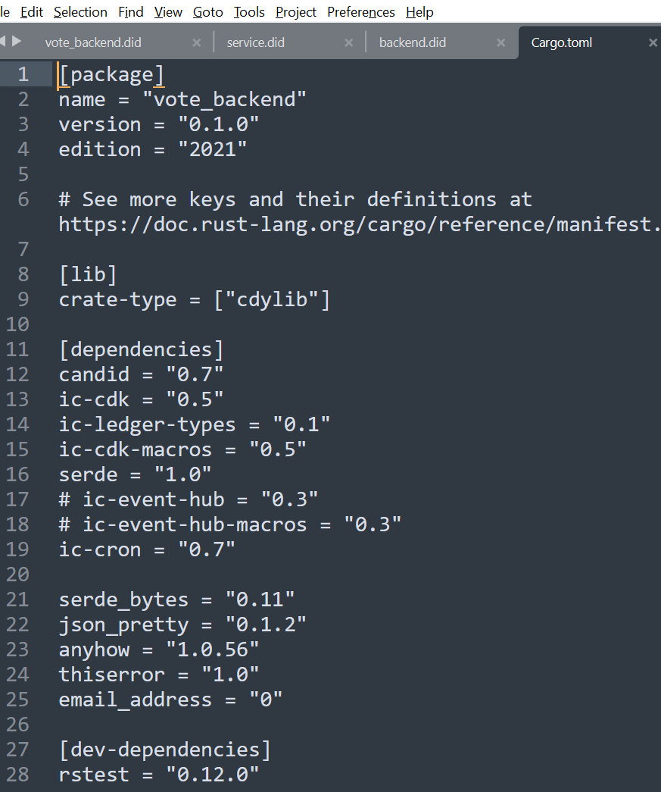
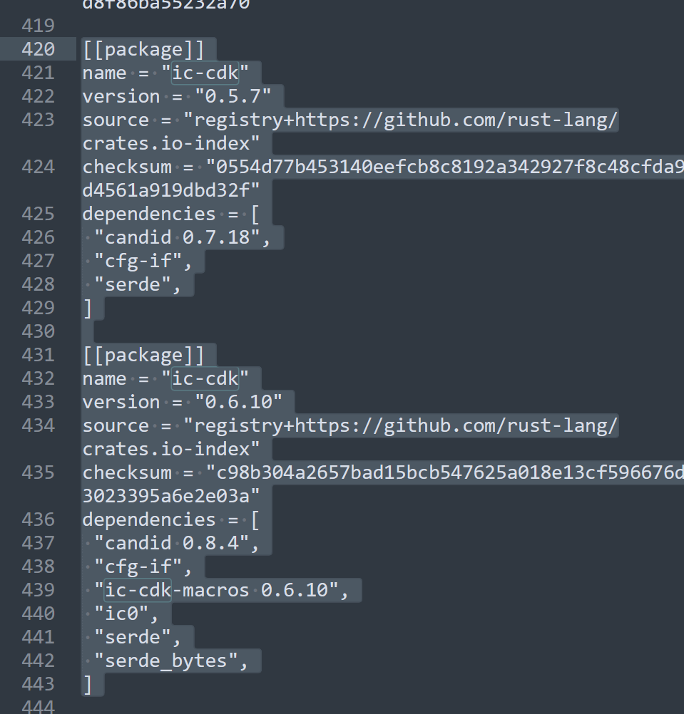
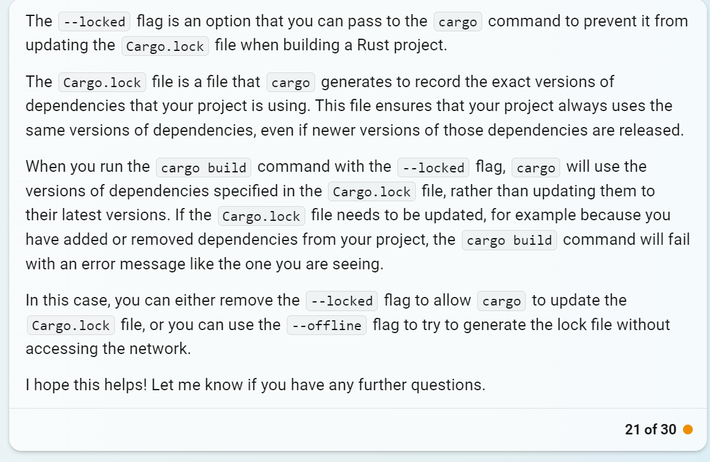

# 构建,依赖管理的工具:Cargo

  
  

cargo.toml 和 cargo.lock 并用

像是一个 Java 中的一个 pom.xml,一般 pom.xml 会指定版本.  
即 pom.xml 通常是锁定依赖版本的.

只是在 rust 里面用了 2 个文件夹.

另外如果 lock 里面有多个同名但是不同版本号的依赖  
表示  
Each version of the ic-cdk crate has its own set of dependencies
