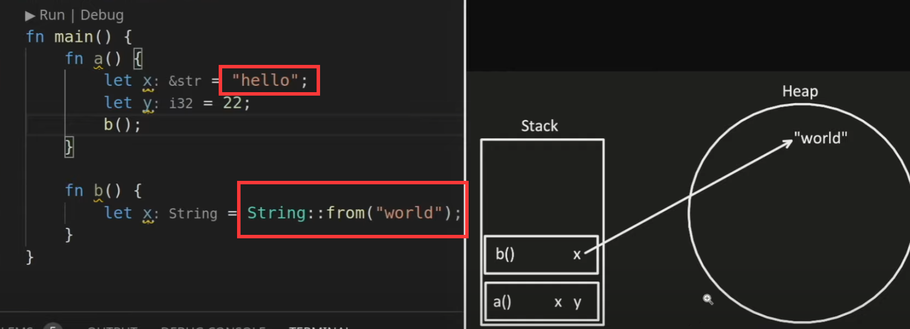

# Rust tutorial

#### Acknowledgements:

This tutorial follows this youtube channel:  
**Let's Get Rusty**  
https://www.youtube.com/watch?v=OX9HJsJUDxA&ab_channel=Let%27sGetRusty  

prerequsite:
This article **assume** you can understand just a little bit of basic knowledge about programming , linux command , vscode editor :)  

## install:

Goto the-rust-book-website:  
https://doc.rust-lang.org/stable/book/ch01-01-installation.html  

input this cmd into linux terminal:

```sh
curl --proto '=https' --tlsv1.2 https://sh.rustup.rs -sSf | sh
```

It is intereactive installing step.  
normal install input 1 into terminal and press enter to install rust-SDKs  

## hello_world

```bash
# Choose your folder and get in  :
mkdir rust
cd rust
mkdir hello
cd hello
touch hello.rs
code . # open vscode editor with this folder location
#it`s also ok to make hello.sh to automate this process after you familiar with it.
```

### install vscode rust-extensions:

At 2023-7-20: just install **rust-analyzer** will finish setup process.  

Continue coding in hello.rs:

```rust
fn main(){
  println!("Let`s get rusty!");
}
```

Compile and run the hello.rs  

```bash
rustc hello.rs  # compile the .rs file to machine code.
./hello # run the rust program.
```

### Some handful settings for vscode :

**quickly toggle bewteen text-editor and integreted-terminal:**  
ctrl+shift+p open command-pannel:  
search : keyboard shortcuts json  
watch out ,not this: (default)keyboard shortcuts json  
**use tab to jumpout the () "" when editing:**  
(instead of right-arrow, too far from hand ,hah)  
install vscode-extension: TabOut  

## Library Auto Management and Auto Build Project Tool for Rust: Cargo

```bash
cargo --version # Check if cargo is installed.
cargo new hello_cargo # Use cargo to create a project.
# It`s like : carge command cmd-para
# the cmd response:
#  Created binary (application) `hello_cargo` package
cd hello_cargo
tree
#  you`ll see the structure of a cargo-project like this:
# .
# ├── Cargo.toml
# └── src
#     └── main.rs
# Cargo.toml is for dependency management

# if you dont have tree application. you may want to install it ,so it will be handy for you .
cargo build # let cargo build the project for you.
cargo run # run the project
# also:
./target/debug/hello_cargo # run the executable file cargo build for you

# some useful command may be use:
carge check  # check the code before compile and run.
```

#### cargo new but without git :

```bash
cargo new guess_game --vcs none
```

### stack and heap:

  
notice that "hello" is on the stack  
but "world" is on the heap.  
